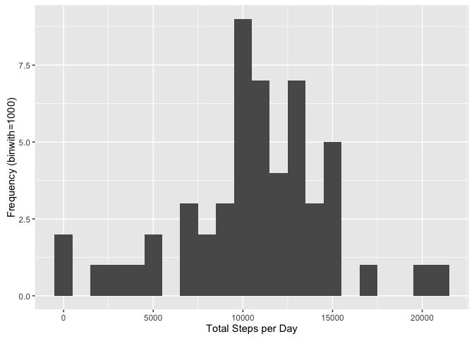
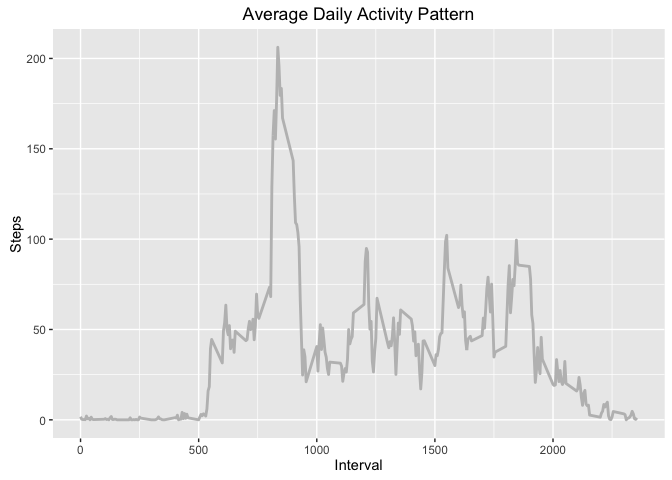
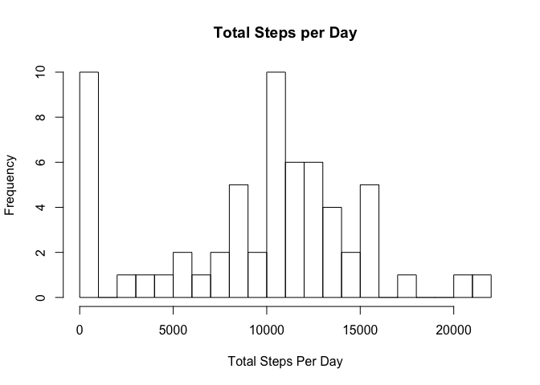

# Reproducible Research: Peer Assessment 1
Mac McEacharn  

## Loading and preprocessing the data


```r
library(ggplot2)
library(lattice)

if (!file.exists("activity.csv") && file.exists("activity.zip")) {
    unzip("activity.zip", exdir = ".")
}
dataWithNA <- read.csv("activity.csv")
data <- na.omit(dataWithNA)
data$date <- as.Date(data$date, format = "%Y-%m-%d")
```


## What is mean total number of steps taken per day?

```r
stepsDay <- tapply(data$steps, data$date, sum)

hist(stepsDay, breaks=20, main="Total Steps per Day",     
     xlab="Total Steps Per Day", 
     ylab="Frequency)")
```




```r
meanStepsDay <- mean(stepsDay,na.rm=TRUE)
paste("Mean Steps per Day=",meanStepsDay)
```

```
## [1] "Mean Steps per Day= 10766.1886792453"
```


```r
medianStepsDay <- median(stepsDay,na.rm = TRUE)
paste("Median Steps per Day=",medianStepsDay)
```

```
## [1] "Median Steps per Day= 10765"
```


## What is the average daily activity pattern?

```r
stepsInterval <- aggregate(data$steps, 
                           by = list(interval = data$interval), 
                           FUN = mean, 
                           na.rm = TRUE)

colnames(stepsInterval) <- c("interval", "steps")
ggplot(stepsInterval, 
       aes(x= interval, y = steps)) +   
    geom_line(size = 1, color="gray") +   
    labs(x = "Interval", 
         y = "Steps", 
         title = "Average Daily Activity Pattern")
```




```r
maxInterval <- stepsInterval[which.max(stepsInterval$steps),]
paste("The interval having the most steps is interval ",
      maxInterval[1],
      sep="")
```

```
## [1] "The interval having the most steps is interval 835"
```
## Imputing missing values


```r
sumNASteps <- sum(is.na(dataWithNA$steps))
sumNADate <- sum(is.na(dataWithNA$date))
sumNAInterval <- sum(is.na(dataWithNA$interval))

totNA <- sumNASteps+ sumNADate + sumNAInterval

paste("The number of missing values is ",
      totNA,
      sep="")
```

```
## [1] "The number of missing values is 2304"
```

### Filling in missing data

```r
filledInData <- dataWithNA

filledInData$steps[is.na(filledInData$steps)] <- 
    median(dataWithNA$steps, 
               na.rm=TRUE)

filledInData <- aggregate(steps ~ date, 
                          data=filledInData, 
                          sum, 
                          na.rm=TRUE)

hist(filledInData$steps, 
     breaks=20, 
     main="Total Steps per Day",     
     xlab="Total Steps Per Day",
     ylab="Frequency")
```




```r
meanStepsDayFilledIn <- mean(filledInData$steps,na.rm=TRUE)
paste("Adjusted Mean Steps per Day=",meanStepsDayFilledIn)
```

```
## [1] "Adjusted Mean Steps per Day= 9354.22950819672"
```


```r
medianStepsDayFilledIn <- median(filledInData$steps,na.rm = TRUE)
paste("Adjusted Median Steps per Day=",medianStepsDayFilledIn)
```

```
## [1] "Adjusted Median Steps per Day= 10395"
```

*The impact of imputing missing data on the estimates of the total daily number of steps is shown below:*


```r
paste("The Difference Between Measured Mean Steps per Day and Adjusted Mean Steps Per Day is =",meanStepsDay - meanStepsDayFilledIn)
```

```
## [1] "The Difference Between Measured Mean Steps per Day and Adjusted Mean Steps Per Day is = 1411.95917104856"
```

```r
paste("The Difference Between Measured Median Steps per Day and Adjusted Median Steps Per Day is =",medianStepsDay - medianStepsDayFilledIn)
```

```
## [1] "The Difference Between Measured Median Steps per Day and Adjusted Median Steps Per Day is = 370"
```

## Are there differences in activity patterns between weekdays and weekends?


## Cleaning up


```r
rm(list=ls())

if (file.exists("activity.csv"))     
    file.remove("activity.csv")
```

```
## [1] TRUE
```
